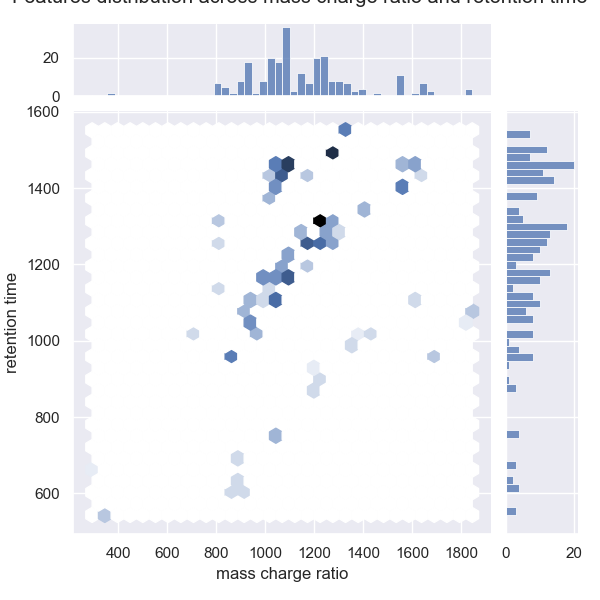
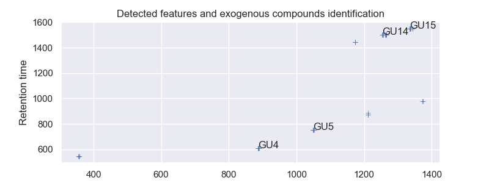
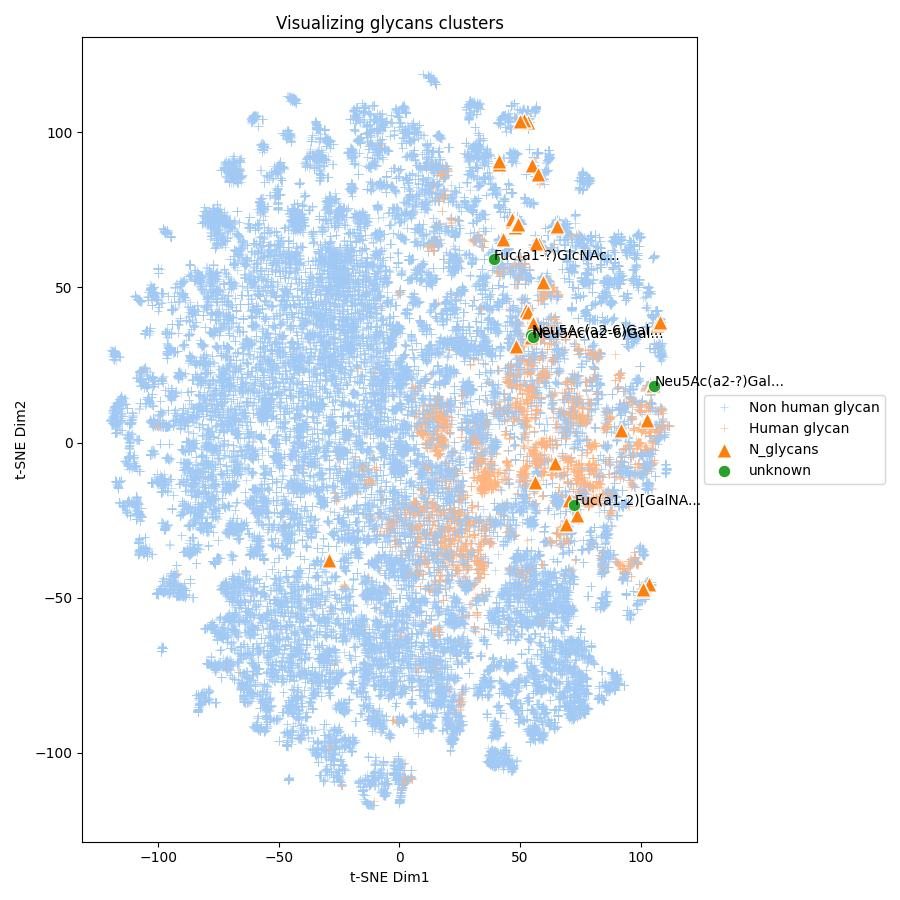
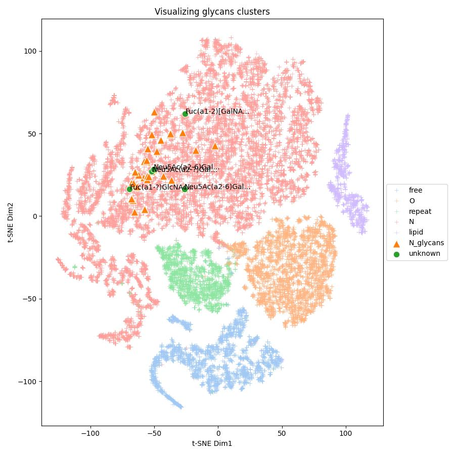
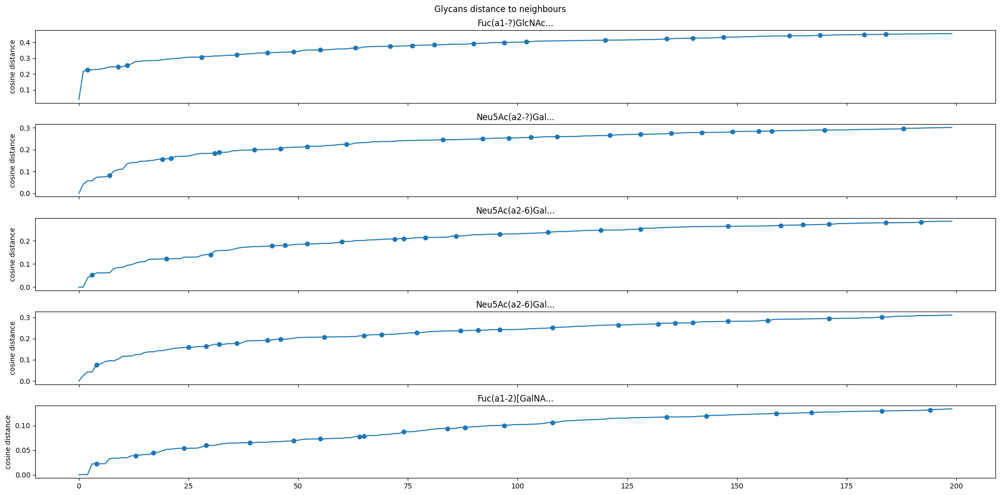

# Isospec analytics interview project

The project directory is structured as follows:

```python
/isospec-internship/
├── data/
├── models/ # For Task 2
├── notebooks/ # For analysis
│   ├── data_processing_&_classification.ipynb
│   ├── eda.ipynb
│   └── glycan_embedding.ipynb
├── scripts/
│   ├── classification.py
│   └── data_processing.py
├── public/
├── README.md
├── project_outline.md # As initially provided
├── reflection.md
├── uv.lock
└── requirements.txt
```

## Task 1

### EDA



* The dataset contains 124 samples with 256 extracted features. The features considered are the chromatographic peaks detected for a given retention time range at a given mass / charge ratio range.  A feature value is the peak intensity integrated over the considered time range. Features intensity ranges on 5 order of magnitude, with 90% of features having a median intensity between 100 and 10'000. To improve comparability, we will further consider intensities on the log-scale.



* Blank samples batch analysis strongly suggests there is no contamination and a study on system suitability samples validates standard samples detection in the experiment.

* **Coefficient of Variation on QC samples**. The relative standard deviation or Coefficient of Variation measures the dispersion of QC measurements, thus repeatability. 50% of features have a coefficient of variation lower than 20% on QC samples, and 75% have a CV below 30%.
* **D-ratio on QC samples**. The D-ratio monitors how much of the total observed variation is due to technical variation. Using median average deviation estimator to compute the D-ratio, we find that 33 features have a D-ratio below 50%.

More on exploratory data analysis can be found in ```notebooks/eda.ipynb```.

### Data processing

Data processing is detailed in ```notebooks/data_processing_&_classification.ipynb``` and can be run independently with ```scripts/data_processing.py```.
We start with 252 features and 79 samples, we end up with 175 features and 67 samples. The data processing pipeline is the following:

* Feature selection :
  * Feature CV on QC samples < 30%
  * Consistent support in detection : select features for which the intensity is above 500 for at least 70% of the samples of the same class
  * D-ratio (optional) : select all features for which D-ratio is below 50%
* Outliers removal : remove samples for which there is at least 4 outliers, based on the Inter Quartile range criterion.
* Feature intensity transformation : for better comparison, map intensities to log scale.

#### Left to do

- [ ] implement intra batch effect correction
- [ ] add all figures to README

I would have liked to correct intensities with QC samples in order to remove intra-batch effect, using spline interpolation. The method is described in the paper [Evaluation and correction of injection order effects in LC-MS/MS based targeted metabolomics](https://www.sciencedirect.com/science/article/pii/S1570023222004184#s0010) and implemented by [tidyms](https://tidyms.readthedocs.io/en/latest/).

### Discriminatory analysis

Discriminatory analysis is detailed in ```notebooks/data_processing_&_classification.ipynb``` and can be run independently with ```scripts/classification.py```.

To perform feature ranking, several approaches can be considered. I started with a Random Forest classifier, because it is more robust to overfitting than Decision Trees and because it enables feature importance ranking, based on their gini index.
I quickly perform cross validation on training samples to search the best number of tree estimators, fixing the `max_depth` to 3 to prevent over fitting since we have more features than samples. The best hyper parameter for the number of tree estimators is 20.

#### Results

| classes  | precision| recall   | f1-score | support  |
|----------|----------|----------|----------|----------|
| Dunn     | 0.86     | 1.00     | 0.92     | 6        |
| French   | 1.00     | 0.80     | 0.89     | 5        |
| LMU      | 1.00     | 1.00     | 1.00     | 3        |

| metrics  |          |          |          | support  |
|----------|----------|----------|----------|----------|
| accuracy |          |          |     0.93 | 14       |
| macro avg| 0.95     | 0.93     | 0.94     | 14       |
| w. avg   | 0.94     | 0.93     | 0.93     | 14       |

**Tab 1. Classification results**

The binary accuracy for the classification task is of 0.93, since one sample of French has been misclassified as Dunn.

Using feature importance from Random Forest classifier, we end up with features 43, 44, 16, 46, 143, 53, 176, 24, 27 and 20 as top-10 features for the classifier to make a decision.
After running a Student t-test, we can assess at the 95% confidence level for features 16, 53 and 176, intensities mean are distinct between Lung cancer and Healthy groups and between Lung cancer and benign disease groups while the difference is not statistically significant between the benign disease and the healthy group.
For all the features that are left, feature mean intensity is different across the three classes.

#### Left to do

- [ ] use Shapley values for model decision explanation
- [ ] define random forest decision boundaries
- [ ] try out classification using MLP
- [ ] use Shapley values for model decision explanation
- [ ] define random forest decision boundaries
- [ ] refine error handling and input validation
- [x] add function comment

## Task 2

I drew inspiration from [Using graph convolutional neural networks to learn a representation for glycans](https://www.sciencedirect.com/science/article/pii/S2211124721006161#sec1)
and kept in mind the following take-aways :
* Sweetnet is a graph convolutional network (GCNN) that provides a useful glycan representation using glycan sequence.
* Sweetnet was trained using _the task of predicting which species a given glycan sequence came from_, ie. a multiclass classification task, for a better model performance comparison. 
The GCNN approach outperformed existing approaches on the classification task. See more about Sweetnet training [here](https://github.com/BojarLab/SweetNet/blob/main/SweetNet_code.ipynb).
* Since solving this task was successful, the authors infered that the hidden glycan representation learned by the network could be meaningful, and demonstrated it on various downstream tasks.

The state of the art embedding for glycans from different species is already computed by Sweetnet. Using graph neural networks seems the best possible approach. Nevertheless, different approaches for embedding can be used:
1) Take advantage of curated Sweetnet GCNN architecture for glycan sequence embedding, train the model on all glycans sequences with the task of predicting the species. 
``` composition ``` and ```tissue_sample``` features could be leveraged for embedding space learning as well, but 1) ```composition``` is redundant with the glycan sequence and 2) ```tissue_sample``` might not exactly reflect glycan presence in tissues.
2) Same task as above predicting the glycan type (eg. N, O, etc...).
3) Explore another type of graph neural network architecture, namely graph transformers ([See HugginFace website](https://huggingface.co/docs/transformers/en/model_doc/graphormer#usage-tips)).

### 1.1 - Learning embedding using Sweetnet architecture trained on species classification task



We can see from the cluster plot that N-linked glycans seem to cluster on the top right part of the graph, mostly on human glycan clusters. Our unknown glycans seem to belong to human glycans clusters, as expected from their tissue sample origin. Two of the unknown glycans with very similar sequence cluster very closely.

### 1.2 Learning embedding using Sweetnet architecture trained on glycan type classification task



Embeddings of the same glycan type cluster tightly on t-SNE plot. Our glycans of interest seem to belong to the N-glycan cluster.

### 2 - Finding relevant neighbours

The task is to find the most similar glycans to the unknown glycans of interest in the embedding space.
Several approaches can be considered:
1) Finding the most relevant neighbours based on a suitable distance metric in the embedding space.
  * The most simple approach is to define a cosine distance threshold and keep all the datapoints below that threshold.
  * The second approach would be to find an inflection point in the distance curve and to define all the neighbours before that point as belonging to the cluster of interest. We will keep this second approach.
  * This stage would need validation with other methods to see whether we end up with semantically consistent clusters around the points of interest.
2) Clustering the data.

I carefully chose the cosine distance or the Manhattan distance metrics as Euclidean distance metrics is not suited for high dimensions, and will focus on the neighbours definition rather than the cluster approach.



We will define as neighbours all the points which are closer than the second inflection point to the glycan of interest. See figure above where only first neighbours are taken into account and where inflection points are scattered on the curve. We will compare metadata gathered by embedding similarities between glycan type and species classification.

| Glycan    | Prop. of human derived neighbours  | Neighbouring glycans type  | Associated diseases (nb of neighbours) |
|-----------|-----------|-----------|-----------|
| Fuc(a1-?)GlcNAc(b1-2)Man(a1-6)[GlcNAc(b1-2)Man(a1-3)]Man(b1-4)GlcNAc(b1-4)[Fuc(a1-6)]GlcNAc | 3 / 13 | N-glycans | female breast cancer (1) |
| Neu5Ac(a2-?)Gal(b1-4)GlcNAc(b1-2)Man(a1-6)[GlcNAc(b1-2)Man(a1-3)]Man(b1-4)GlcNAc(b1-4)[Fuc(a1-6)]GlcNAc | 7 / 22 | N-glycans | type_2_diabetes_mellitus (1),<br>oesophageal cancer (1),<br>colorectal cancer (2) |
| Neu5Ac(a2-6)Gal(b1-4)GlcNAc(b1-2)Man(a1-6)[Gal(b1-4)GlcNAc(b1-2)Man(a1-3)]Man(b1-4)GlcNAc(b1-4)GlcNAc | 15 / 39 | N-glycans | Toxoplasma_gondii_infection (2),<br>esophageal_cancer (1),<br>lung_non_small_cell_carcinoma (1),<br>type_2_diabetes_mellitus(1) |
| Neu5Ac(a2-6)Gal(b1-4)GlcNAc(b1-2)Man(a1-6)[GlcNAc(b1-2)Man(a1-3)]Man(b1-4)GlcNAc(b1-4)GlcNAc | 11 / 25 | N-glycans | colorectal_cancer (3),<br>type_2_diabetes_mellitus (1),<br>esophageal_cancer (1) |
| Fuc(a1-2)[GalNAc(a1-3)]Gal(b1-4)GlcNAc(b1-2)Man(a1-6)[Gal(b1-4)GlcNAc(b1-2)Man(a1-3)]Man(b1-4)GlcNAc(b1-4)GlcNAc | 4 / 10 | N-glycans | None |

**Tab.2 : Metadata gathered from glycan type embeddings similarities** 


| Glycan    | Prop. of human derived neighbours  | Neighbouring glycans type  | Associated diseases  |
|-----------|-----------|-----------|-----------|
| Fuc(a1-?)GlcNAc(b1-2)Man(a1-6)[GlcNAc(b1-2)Man(a1-3)]Man(b1-4)GlcNAc(b1-4)[Fuc(a1-6)]GlcNAc | 4 / 10 | N-glycans | None |
| Neu5Ac(a2-?)Gal(b1-4)GlcNAc(b1-2)Man(a1-6)[GlcNAc(b1-2)Man(a1-3)]Man(b1-4)GlcNAc(b1-4)[Fuc(a1-6)]GlcNAc | 12 / 20 | N-glycans | type_2_diabetes_mellitus (3),<br>benign_breast_tumor_tissues_vs_para_carcinoma_tissues (2),<br>filarial_elephantiasis(2),<br>lung_non_small_cell_carcinoma (2),<br>vernal_conjunctivitis (2),<br>diabetic_kidney_disease(1),<br>gastric_cancer(1) |
| Neu5Ac(a2-6)Gal(b1-4)GlcNAc(b1-2)Man(a1-6)[Gal(b1-4)GlcNAc(b1-2)Man(a1-3)]Man(b1-4)GlcNAc(b1-4)GlcNAc | 15 / 21 | N-glycans | Parkinson_disease(1),<br>cholangiocarcinoma (2),<br>influenza(2),<br>multiple_sclerosis(1),<br>pancreatic_cancer(2),<br>stomach_cancer(2),<br>thyroid_gland_papillary_carcinoma(2),<br>colorectal_cancer(3),<br>LPS_induced_inflammation(1),<br>staphyloenterotoxemia(1) |
| Neu5Ac(a2-6)Gal(b1-4)GlcNAc(b1-2)Man(a1-6)[GlcNAc(b1-2)Man(a1-3)]Man(b1-4)GlcNAc(b1-4)GlcNAc | 17 / 26 | N-glycans | cholangiocarcinoma (2),<br>pancreatic_cancer (2),<br>stomach_cancer (2),<br>staphyloenterotoxemia (1),<br>LPS_induced_inflammation(1),<br>Parkinson_disease(1),<br>influenza (1),<br>multiple_sclerosis (1),<br>thyroid_gland_papillary_carcinoma (1),<br>cystic_fibrosis (1) |
| Fuc(a1-2)[GalNAc(a1-3)]Gal(b1-4)GlcNAc(b1-2)Man(a1-6)[Gal(b1-4)GlcNAc(b1-2)Man(a1-3)]Man(b1-4)GlcNAc(b1-4)GlcNAc | 7 / 14 | N-glycans | None |

**Tab.3 : Metadata gathered from species embedding similarities** 

The aggregated results over neighbours were reported above. Note that some neighbours didn't present metadata (ie. ```disease_association = None```).

We would need to statistically validate the following hypotheses to assess the embedding utility evidence  :
* Glycan embeddings resulting from both classification tasks bring together glycans from the same species.
* Glycan embeddings resulting from species classification task bring together glycans with the same disease association.

### Left todos

* [ ] report models classification accuracy on a test set and compare to paper's reported accuracy
* [ ] add figures to README
* [ ] validate neighbours finding method
* [ ] try out embedding learning with graph transformers
* [ ] highlight properly evidences for embedding usefulness
* [ ] find statistical significance of disease association for embedded glycans of interest

## Ressources

* [LC MS Experiment](https://pyopenms.readthedocs.io/en/latest/user_guide/background.html)
* [D-Ratio](https://pmc.ncbi.nlm.nih.gov/articles/PMC10222478/)
* [Coefficient of Variation](https://pmc.ncbi.nlm.nih.gov/articles/PMC3695475/)
* [Guidelines for the use of QC samples](https://link.springer.com/article/10.1007/s11306-018-1367-3)
* [LC-MS data processing with python](https://pmc.ncbi.nlm.nih.gov/articles/PMC7602939)
* [Glycan Analysis](https://www.mdpi.com/2218-273X/13/4/605)
* [Glycowork](https://github.com/BojarLab/glycowork)
* [Using graph convolutional neural networks to learn a representation for glycans](https://www.sciencedirect.com/science/article/pii/S2211124721006161#sec1)
* [Graphormer from HuggingFace](https://huggingface.co/docs/transformers/en/model_doc/graphormer#graphormer)
* [Graph transformers](https://huggingface.co/blog/intro-graphml)
* [UV package manager](https://docs.astral.sh/uv/guides/projects/)